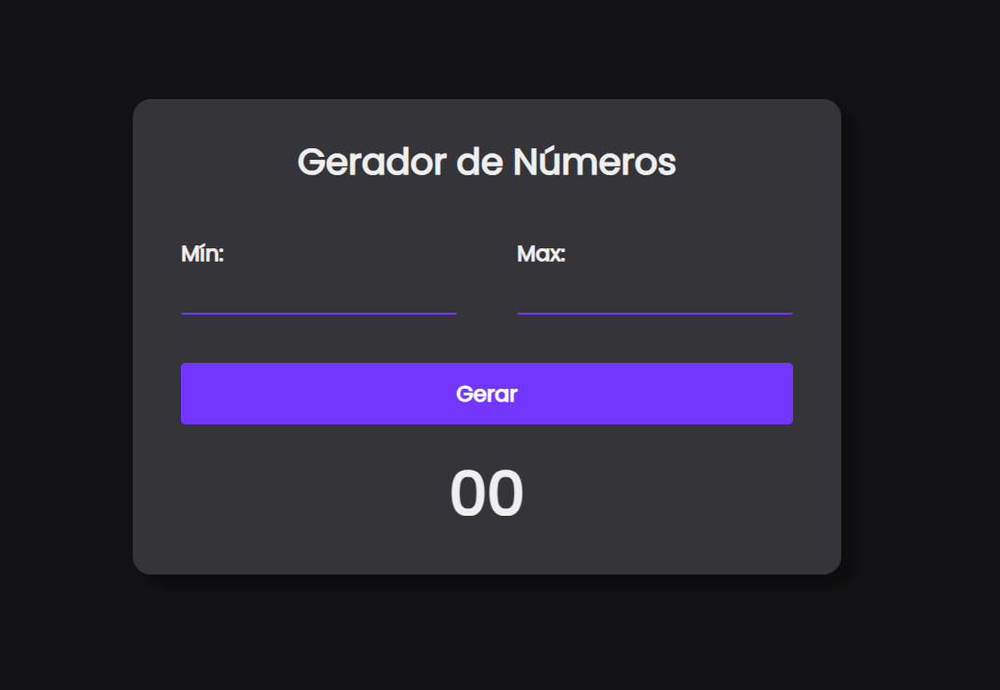

# Gerador de Números
Projeto que gera números aleatórios por meio de um número minímo e máximo sendo escolhidos pelo usuário. <strong>HTML, CSS e JavaScript</strong> foram utilizados no desenvolvimento do projeto.

## Tecnologias Utilizadas

 
   
   
   

 

## 💻 Requisitos
- Acesso à internet.
- Acessar o link.
- Escolher número mínimo e máximo.

## Implantar 
Link do projeto: https://felipermendess.github.io/gerador-de-numeros/

## Minhas Redes
Meu linkedin: https://www.linkedin.com/in/felipermendess/  
Instagram: https://www.instagram.com/felipermendess_/  
Email: felipermendes04@gmail.com
